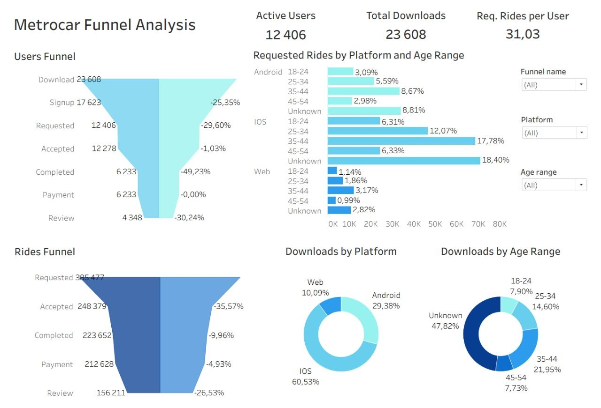

# 🚗 Metrocar Funnel Analysis

> Evaluating user conversion from app download to first completed ride — identifying drop-off points, demand patterns, and growth opportunities.

---

## 📌 Project Overview

This project analyzes the **Metrocar** ride-sharing app funnel to identify where and why users drop off between key stages — from app download through registration, ride request, trip completion, payment, and review.

The analysis is segmented by **platform** (iOS / Android / Web) and **age group**, and is designed to support data-driven decisions that improve conversion rates, user experience, and completed ride volume.

---

## 🛠️ Tools & Technologies

| Purpose | Tool |
|---|---|
| Data processing & calculations | [Google Sheets](https://docs.google.com/spreadsheets/d/1jBYosg2WQB116v6XIYiBPpZdz3neYhtzsvnp0aAnADQ/edit?gid=2025238614#gid=2025238614) |
| Data extraction & analysis | [SQL] |
| Data visualization & dashboard | [Tableau]

---

## 📊 Interactive Dashboard

🔗 **[View on Tableau Public](https://public.tableau.com/views/MetrocarFunnelAnalysis_17678222263480/MetrocarFunnelAnalysis)**



---

## 📂 Repository Structure

```
Metrocar_Funnel_Analysis/
│
├── queries.sql                   # SQL queries for data extraction & analysis
├── dashboard_preview.jpg         # Tableau dashboard preview
├── metrocar_funnel_report.pdf    # Full analysis report with findings
└── README.md
```

---

## 🔍 SQL Queries Overview

The analysis uses **9 SQL queries** covering:

| # | Description |
|---|---|
| 1 | Users funnel — segmented by platform and age group |
| 2 | Users funnel — overall conversion calculations |
| 3 | Rides funnel — segmented by platform and age group |
| 4 | Rides funnel — overall conversion calculations |
| 5 | Average waiting time & demand patterns by day and hour |
| 6 | App downloads by platform |
| 7 | Download visualization data for Tableau |
| 8 | Active users — rides per user by age group |
| 9 | Completed rides segmented by age group |

📄 [View SQL queries](queries.sql)

---

## 📊 Key Findings

### 👤 Users Funnel

| Step | Stage | Users | Conversion | Absolute Loss |
|:---:|---|---:|---:|---:|
| 1 | Download | 23 608 | — | — |
| 2 | Signup | 17 623 | 74.65% | 5 985 |
| 3 | Requested | 12 406 | 70.40% | 5 217 |
| 4 | Accepted | 12 278 | 98.97% | 128 |
| 5 | **Completed** ⚠️ | **6 233** | **50.77%** | **6 045** |
| 6 | Payment | 6 233 | 100.00% | 0 |
| 7 | Review | 4 348 | 69.76% | 1 885 |

> 🔴 **Main drop-off:** Accepted → Completed (−49%) — nearly half of accepted trips are not completed.

---

### 🚕 Rides Funnel

| Step | Stage | Rides | Conversion | Absolute Loss |
|:---:|---|---:|---:|---:|
| 1 | Requested | 385 477 | — | — |
| 2 | **Accepted** ⚠️ | **248 379** | **64.43%** | **137 098** |
| 3 | Completed | 223 652 | 90.04% | 24 727 |
| 4 | Payment | 212 628 | 95.07% | 11 024 |
| 5 | Review | 156 211 | 73.47% | 56 417 |

> 🔴 **Main drop-off:** Requested → Accepted (−36%) — significant unmet demand due to inefficient driver matching.

---

### ⏱️ Demand & Waiting Time

- **Peak hours:** 8–9 AM and 4–7 PM — average wait times exceed **~7 minutes**
- **Peak risk day:** Friday evenings show the highest drop-off risk
- **Key insight:** Driver wait time is the **strongest predictor of user churn**, outweighing day-of-week effects

---

### 📱 Downloads by Platform

| Platform | Downloads | % of Total |
|---|---:|---:|
| iOS | 14 290 | 60.53% |
| Android | 6 935 | 29.38% |
| Web | 2 383 | 10.09% |

---

### 👥 Active Users by Age Group

| Age Range | Users | Rides | Rides/User | % of Total |
|---|---:|---:|---:|---:|
| Unknown | 3 734 | 115 729 | 30.99 | 30.02% |
| 35–44 | 3 662 | 114 209 | 31.19 | 29.63% |
| 25–34 | 2 425 | 75 236 | 31.03 | 19.52% |
| 18–24 | 1 300 | 40 620 | 31.25 | 10.54% |
| 45–54 | 1 285 | 39 683 | 30.88 | 10.29% |

> Core audience: **25–44** accounts for over 50% of total demand with consistent ~31 rides/user.

---

## 💡 Key Recommendations

### 🛡️ Protect Revenue
- Reduce trip cancellations through better ETA accuracy and service reliability
- Set **sub-7-minute wait time** as an operational KPI

### 🚀 Increase Activation
- Simplify onboarding and incentivize the first ride
- Target **18–24** segment with student offers and referral programs

### 🔧 Unlock Supply Efficiency
- Improve driver availability during **peak hours** via targeted incentives and dynamic scheduling
- Apply demand forecasting to pre-position drivers ahead of peaks
- Apply stronger incentives on **Friday evenings**

### 💬 Strengthen Retention Signals
- Drive post-payment reviews through lightweight prompts or rewards
- Use tailored nudges (discounts, loyalty benefits) for mid- and lower-performing age groups

### 📱 Platform & Marketing Strategy
- Prioritize **iOS** as the primary acquisition channel
- Maintain secondary investment in **Android** for scale
- Limit Web spending; redirect to retargeting only

### 🗂️ Data Quality
- Reduce **"Unknown age"** segment (~30%) by improving user profile data collection
- Improve segmentation precision to enable more targeted decisions

---

## 👩‍💻 Author

**Anna Denysenko** — Data Analyst
